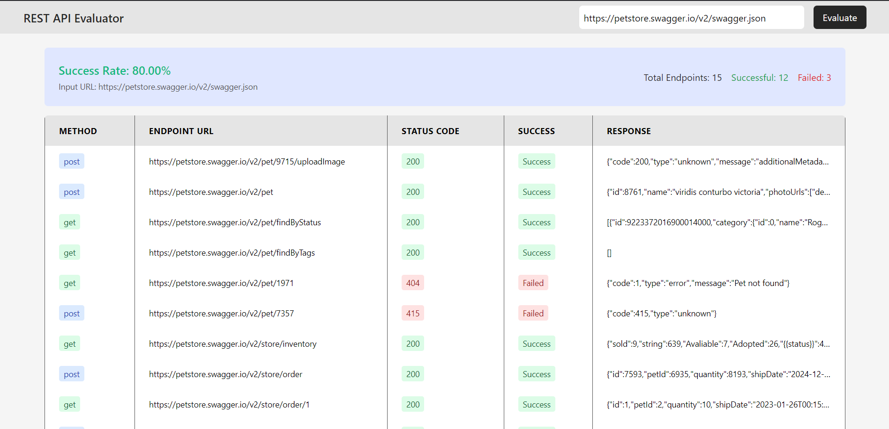

#  REST API Evaluator

## Project Overview
This application evaluates REST APIs by parsing an OpenAPI Specification (OAS) file, executing endpoints, and generating a comprehensive report.



## Prerequisites
- Node.js (v16 or later)
- npm 
- Docker - For containerized deployment.
- Docker Compose - To orchestrate multi-container setups.

## Deployment Instructions
1. Clone the repository:
```bash
git clone https://github.com/Aqeeb007/rest-api-evaluator.git
cd rest-api-evaluator
```

2.Build and Run with Docker Compose:
```bash
# Start the project using Docker Compose
docker-compose up --build -d
```

3.Access the Application:
```bash
# Open your browser and navigate to 
http://localhost:3000
```

## VS Code Setup
1. Clone the repository:
```bash
git clone https://github.com/Aqeeb007/rest-api-evaluator.git
cd rest-api-evaluator
```

2. Install dependencies:
```bash
# Backend dependencies
cd backend
npm install

# Frontend dependencies
cd ../frontend
npm install
```

3. Set up environment variables:
Create a `.env` file in the backend directory with:
```
PORT=8080
```
Create a `.env` file in the frontend directory with:
```
VITE_SERVER_API_URL=http://localhost:8080/api
```

4. Run the application:
```bash
# Start backend (in backend directory)
npm run dev

# Start frontend (in frontend directory)
npm run dev
```


## Assumptions Made
1. All OAS files are publicly accessible or provided via URL/file upload
2. Dummy input generation will be based on Schema definitions in OAS
